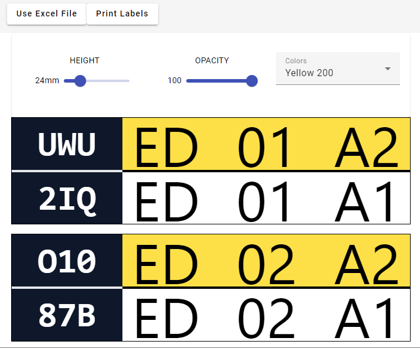

# RackLabelTool

## How to Use Excel File

Place all the label data in column 'A' using the following format: `[check digit] [location]`. 

**Example**: `uwu DD 23 A2`

### Important Points to Note
- Separators like spaces or commas are not required.
- Case sensitivity is not important; the app will handle it.
- The items don't have to be in any particular order.
  
The application will automatically match a label pair based on the given criteria, making the process simple and straightforward.

**Happy labeling!**

 

